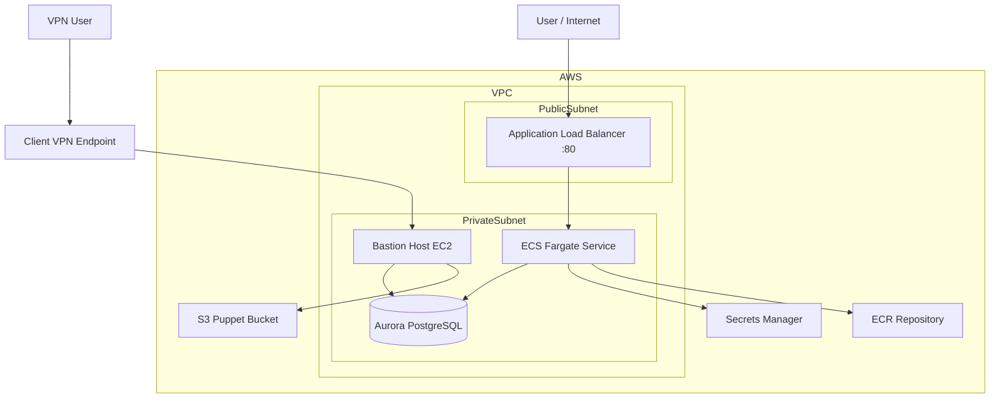
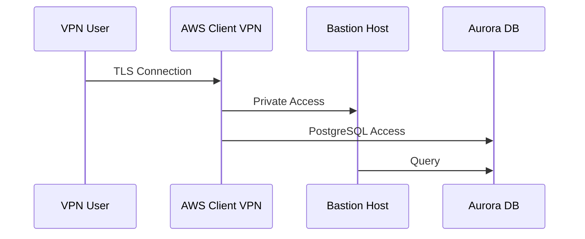
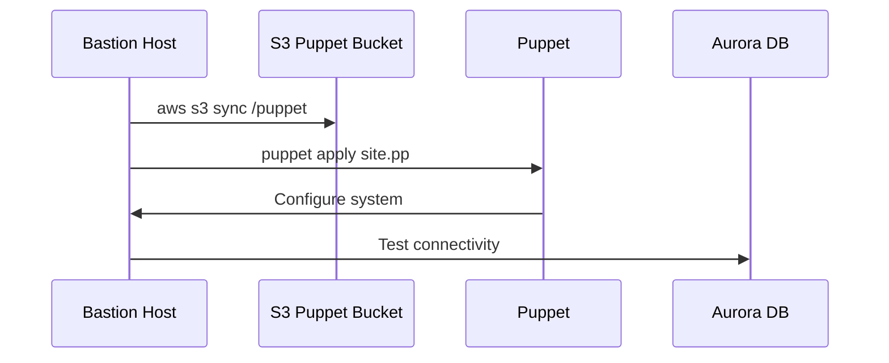
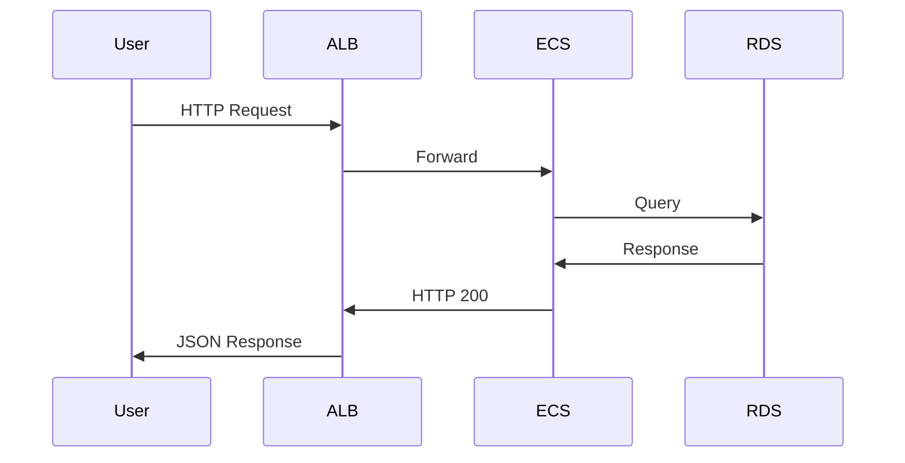
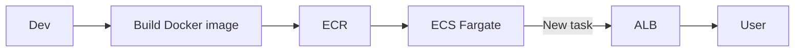

# 📦 Project: AWS Infrastructure with CDK, ECS, RDS, Puppet and FastAPI

This project provisions a complete infrastructure on AWS using AWS CDK (Python), integrating:

- VPC with public and private subnets
- EC2 Bastion Host with Puppet
- RDS Aurora PostgreSQL Serverless v2
- ECS Fargate
- ECR
- Application Load Balancer
- FastAPI Application
- Client-to-Site VPN
- CI/CD Pipeline with GitHub Actions

## 🗺️ Architecture



## 🧱 Infrastructure Components

### 🪣 S3 (Puppet Bucket)

Bucket responsible for storing Puppet manifests and modules.

**Function:**

- Centralize configuration files
- Allow Bastion Host to automatically sync manifests

### 🌐 VPC
- 2 AZs
- Subnets:
  - Public (ALB)
  - Private with NAT (ECS, RDS, Bastion)

### 🔐 VPN (Client-to-Site)

AWS-managed VPN for secure access to the private environment.

**Functions:**

- Allows access to Bastion Host without public IP
- Private database access for administration
- Certificate-based authentication
  
**Flow:**

- User connects via OpenVPN Client
- Traffic enters Client VPN Endpoint
- Forwarded to private subnets
- Access to Bastion Host and RDS



### 🖥️ Bastion Host (EC2)

Private EC2 instance used for:

- Administrative access via AWS SSM
- Puppet execution
- VPN access

**Functions:**

- Installs Puppet
- Syncs files from S3
- Automatically applies manifests on boot

**Executed snippet:**

```
aws s3 sync s3://<bucket>/puppet /opt/puppet
puppet apply puppet/manifests/site.pp
```

### 🗄️ RDS Aurora PostgreSQL Serverless v2

Relational database:

- Engine: Aurora PostgreSQL 14

- Serverless (auto scaling)

- Access allowed only:
    - Bastion Host
    - ECS
    - VPN 

- Credentials:
    - Automatically generated by Secrets Manager

### 🐳 ECR (Elastic Container Registry)

Repository for storing the FastAPI application Docker image.

### 🚀 ECS Fargate

Runs the FastAPI application as a container.

**Configuration:**

- Task Definition
- Environment variables:
  - DB_NAME
  - DB_HOST

- Secrets:
  - DB_USER
  - DB_PASSWORD

### ⚖️ Application Load Balancer (ALB)

- Port: 80
- Routes requests to ECS
- Health check: `/health`

## 🧩 FastAPI Application

**Location:** - `app_fastapi/`

**Function:**

- REST API
- Connected to PostgreSQL database
- Exposed via ALB

**Endpoint example:**

- GET `/health`

## 🧙 Puppet

**Structure:**

```bash
puppet/
├── manifests
│   └── site.pp
└── modules
    ├── users
    └── phpmyadmin
```

**Functions:**

- User creation
- Package installation
- Automatic instance configuration
- Automatically applied on Bastion Host.

## ⚙️ GitHub Actions (Workflow)

Pipeline responsible for:

- Authenticating to AWS via OIDC
- Installing dependencies
- Executing: `cdk deploy --require-approval never`

**Triggers:**

- Push to main branch
- Manual (workflow_dispatch)

## ▶️ How to Execute

1. **Install dependencies**

```bash
pip install -r requirements.txt
npm install -g aws-cdk
CDK Bootstrap
```
2. **CDK Bootstrap**
```bash
cdk bootstrap
Deploy infrastructure
```
3. **Deploy**
```bash
cdk synth
cdk deploy
```

##📤 Outputs

At the end of deployment:

- Public application URL
- Bastion instance ID
- Database endpoint
- Secret ARN
- Puppet bucket name

## 🔐 Best Practices Implemented
✔️ Private subnets
✔️ No public IP on ECS
✔️ Credentials in Secrets Manager
✔️ Infrastructure as code (CDK)
✔️ Automation with Puppet
✔️ CI/CD with GitHub Actions
✔️ Secure access via VPN

## 🧠 Technologies

- AWS CDK (Python)
- FastAPI
- ECS Fargate
- Aurora PostgreSQL
- Puppet
- Docker
- GitHub Actions
- OpenVPN / AWS Client VPN

## 📌 Notes

This project is educational and demonstrates:

- Infrastructure + App integration
- Automated infrastructure
- Automatic configuration via Puppet
- Continuous deployment with pipeline
- Secure private access via VPN

## 🔁 Boot Flow



## 🚀 Application Flow (Request)



## ⚙️ Pipeline Flow (GitHub Actions)

```mermaid
flowchart LR
    Dev["Dev pushes to main"] --> GitHub["GitHub Repo"]

    GitHub --> Actions["GitHub Actions Workflow"]

    Actions --> Checkout["Checkout code"]
    Checkout --> Auth["AWS Auth (OIDC)"]
    Auth --> Deps["Install dependencies"]
    Deps --> CDK["cdk deploy"]

    CDK --> CloudFormation["CloudFormation Stack"]
    CloudFormation --> Infra["Provisioned/Updated Infra"]
```


##🧩 Application Deployment Flow

