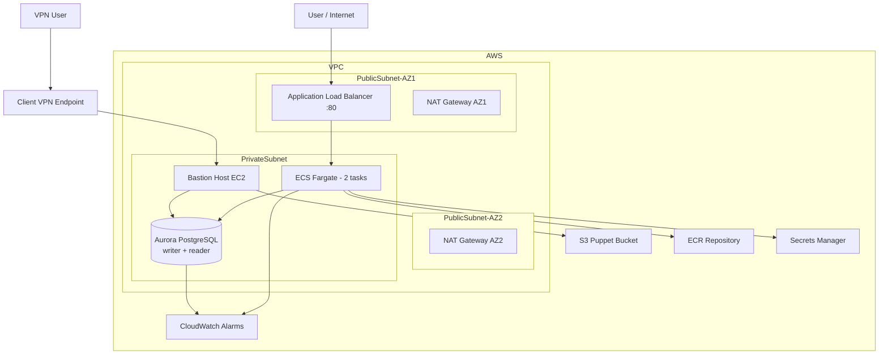
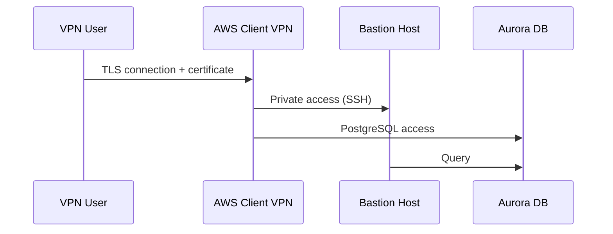
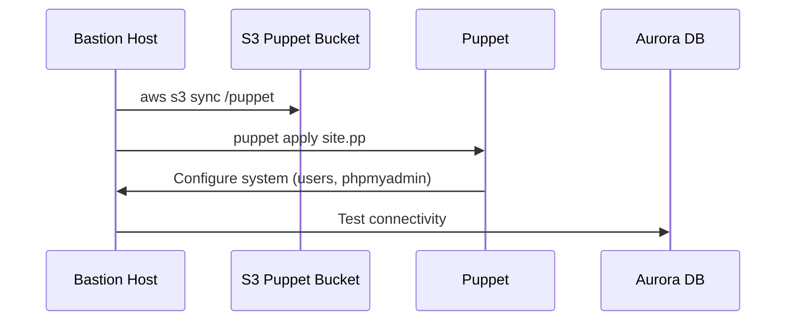
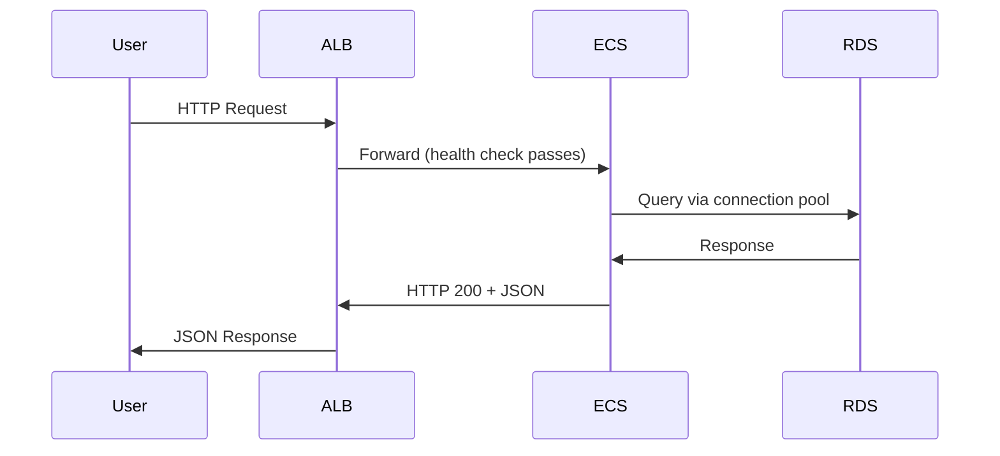
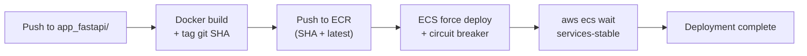

# Project: AWS Infrastructure with CDK, ECS, RDS, Puppet and FastAPI

This project provisions a **production-ready** infrastructure on AWS using AWS CDK (Python), integrating:

- Multi-AZ VPC with redundant NAT Gateways
- EC2 Bastion Host with Puppet and IMDSv2
- RDS Aurora PostgreSQL Serverless v2 with backup and deletion protection
- ECS Fargate with high availability and auto-scaling
- ECR with lifecycle rules
- Application Load Balancer with deletion protection
- FastAPI application with connection pooling and error handling
- Client-to-Site VPN with connection logs
- Monitoring via CloudWatch Alarms
- CI/CD Pipeline with GitHub Actions

## Architecture


```mermaid
flowchart TB
    User[User / Internet] --> ALB[Application Load Balancer :80]
    DevVPN[VPN User] --> VPN[Client VPN Endpoint]

    subgraph AWS
        subgraph VPC
            subgraph PublicSubnet-AZ1
                ALB
                NAT1[NAT Gateway AZ1]
            end
            subgraph PublicSubnet-AZ2
                NAT2[NAT Gateway AZ2]
            end

            subgraph PrivateSubnet
                ECS[ECS Fargate - 2 tasks]
                Bastion[Bastion Host EC2]
                RDS[(Aurora PostgreSQL\nwriter + reader)]
            end
        end

        S3[S3 Puppet Bucket]
        ECR[ECR Repository]
        Secrets[Secrets Manager]
        CW[CloudWatch Alarms]
    end

    VPN --> Bastion
    ALB --> ECS
    ECS --> RDS
    ECS --> Secrets
    Bastion --> RDS
    Bastion --> S3
    ECS --> ECR
    ECS --> CW
    RDS --> CW
```

## Infrastructure Components

### S3 (Puppet Bucket)

Bucket responsible for storing Puppet manifests and modules.

- Versioning enabled
- AWS-managed encryption
- Public access fully blocked
- Retention policy: data preserved even after stack removal
- Lifecycle: old versions expire after 90 days

### VPC

- 2 AZs
- **2 NAT Gateways** (high availability per zone)
- Public subnets (ALB, NAT)
- Private subnets with egress (ECS, RDS, Bastion)
- **VPC Flow Logs** enabled for traffic auditing

### VPN (Client-to-Site)

AWS-managed VPN for secure access to the private environment.

- Access to Bastion Host without a public IP
- Mutual certificate-based authentication
- Split tunnel enabled
- **Connection logs** in CloudWatch (3-month retention)


```mermaid
sequenceDiagram
    participant User as VPN User
    participant VPN as AWS Client VPN
    participant Bastion as Bastion Host
    participant RDS as Aurora DB

    User->>VPN: TLS connection + certificate
    VPN->>Bastion: Private access (SSH)
    VPN->>RDS: PostgreSQL access
    Bastion->>RDS: Query
```

### Bastion Host (EC2)

Private EC2 instance used for administrative access.

- Type: `t3.small`
- **IMDSv2 required** (SSRF protection)
- Access via AWS SSM (no public port exposure)
- SSH allowed only from the VPN security group

**Automatic initialisation:**

```bash
aws s3 sync s3://<bucket>/puppet /opt/puppet
puppet apply /opt/puppet/manifests/site.pp
```

### RDS Aurora PostgreSQL Serverless v2

| Configuration | Value |
|---|---|
| Engine | Aurora PostgreSQL 14 |
| Minimum capacity | 0.5 ACU |
| Maximum capacity | 8 ACU |
| Backup | 7-day retention |
| Deletion protection | Enabled |
| Stack removal | Snapshot preserved |
| Enhanced Monitoring | 60s interval |
| Exported logs | PostgreSQL → CloudWatch |
| Encryption | Enabled |
| Credentials | Generated by Secrets Manager |

### ECR (Elastic Container Registry)

- Vulnerability scan on every push
- Retention policy: images preserved after stack removal
- Lifecycle rules:
  - Untagged images removed after 1 day
  - Maximum of 10 images per repository

### ECS Fargate

Runs the FastAPI application with high availability.

| Configuration | Value |
|---|---|
| CPU per task | 512 units (0.5 vCPU) |
| Memory per task | 1024 MiB |
| Desired tasks | 2 (minimum) |
| Auto-scaling | min=2, max=10 |
| CPU scaling | target 70% |
| Memory scaling | target 80% |
| Circuit breaker | Enabled with automatic rollback |
| Container Insights | Enabled |
| Container health check | `GET /health` every 30s |

**Separate IAM roles:**
- **Execution Role**: ECR image pull + secret injection (principle of least privilege)
- **Task Role**: CloudWatch logs write only

**Injected variables:**

| Variable | Source |
|---|---|
| `DB_NAME` | Environment variable |
| `DB_HOST` | Environment variable |
| `DB_USER` | Secrets Manager |
| `DB_PASSWORD` | Secrets Manager |

### Application Load Balancer (ALB)

- Port: 80
- Routes requests to ECS
- Health check: `GET /health` (threshold: 2 healthy / 3 unhealthy)
- Deregistration delay: 30s
- **Deletion protection** enabled

### CloudWatch Alarms

| Alarm | Threshold | Periods |
|---|---|---|
| ECS CPU | > 85% | 3 of 3 |
| ECS Memory | > 90% | 3 of 3 |
| ALB Response Time | > 2s | 2 of 2 |

## FastAPI Application

**Location:** `app_fastapi/`

**Endpoints:**

| Method | Path | Description |
|---|---|---|
| GET | `/health` | Health check with real database connectivity validation |
| POST | `/items` | Insert an item (JSON body: `{"name": "..."}`) |
| GET | `/items` | List items (query param: `limit`, default 50) |

**Production features:**

- Connection pool (`ThreadedConnectionPool`, min=1, max=10)
- Error handling with transaction rollback
- Structured logging
- Input validation via Pydantic
- Table schema created automatically on startup
- Health check validates real database connectivity

**Usage examples:**

```bash
# Health check
curl http://<ALB-DNS>/health

# Create item
curl -X POST http://<ALB-DNS>/items \
  -H "Content-Type: application/json" \
  -d '{"name": "my-item"}'

# List items
curl "http://<ALB-DNS>/items?limit=10"
```

## Dockerfile

- Base image: `python:3.11-slim`
- **Non-root user** (`appuser`)
- **Native Docker HEALTHCHECK**
- Uvicorn with 2 workers

## Puppet

**Structure:**

```
puppet/
├── manifests/
│   └── site.pp
└── modules/
    ├── users/
    │   └── manifests/init.pp
    └── phpmyadmin/
        └── manifests/init.pp
```

**Modules:**

- `users`: creates the `adminuser` user with `.ssh` directory
- `phpmyadmin`: installs `httpd`, `php` and `phpmyadmin`

## GitHub Actions (Workflows)

### Infra Deploy (`infra-deploy.yml`)

Triggered by push to `cdk_infra_test/`, `app.py`, `requirements.txt` or `cdk.json`.

```
Checkout → AWS OIDC Auth → cdk synth → cdk deploy
```

### App Build & Push (`app-build-push.yml`)

Triggered by push to `app_fastapi/`.

```
Checkout → AWS OIDC Auth → ECR URI from CloudFormation
→ Docker build → Tag with git SHA + latest
→ Push ECR → ECS force deploy → Wait for stabilisation
```

- ECR URI fetched dynamically from CloudFormation outputs (no hardcoding)
- Image tagged with `git SHA` for traceability and `latest` for convenience
- `aws ecs wait services-stable` ensures the deployment stabilised before reporting success

### Puppet Sync (`puppet-sync.yml`)

Triggered by push to `puppet/`.

```
Checkout → AWS OIDC Auth → S3 sync → Reboot Bastion
```

## How to Execute

1. **Install dependencies**

   ```bash
   pip install -r requirements.txt
   npm install -g aws-cdk
   ```

2. **CDK Bootstrap** (first time only)

   ```bash
   cdk bootstrap
   ```

3. **Validate synthesis**

   ```bash
   cdk synth
   ```

4. **Deploy infrastructure**

   ```bash
   cdk deploy
   ```

5. **Run tests**

   ```bash
   pip install -r requirements-dev.txt
   pytest
   ```

## CloudFormation Outputs

| Output | Description |
|---|---|
| `ApplicationURL` | Public application URL |
| `BastionInstanceID` | Bastion instance ID |
| `DatabaseClusterEndpoint` | Aurora cluster endpoint |
| `DatabaseName` | Database name (`appdb`) |
| `DatabaseSecretArn` | Secret ARN with credentials |
| `EcsClusterName` | ECS cluster name |
| `EcsServiceName` | ECS service name |
| `EcrRepositoryUri` | ECR repository URI |
| `PuppetBucketName` | Puppet bucket name |
| `VpnEndpointId` | VPN endpoint ID |

## Best Practices Implemented

**Network and access:**
- Private subnets for all workloads
- No public IP on ECS
- Administrative access exclusively via VPN + SSM
- IMDSv2 required on Bastion
- VPC Flow Logs enabled

**Database:**
- Credentials managed by Secrets Manager
- Deletion protection enabled
- 7-day backup retention
- Snapshot preserved on stack deletion
- Encryption at rest enabled
- Enhanced monitoring and exported logs

**Application:**
- Least-privilege IAM roles (execution role ≠ task role)
- Connection pooling for efficiency
- Circuit breaker with automatic rollback
- Auto-scaling based on real metrics

**Images:**
- Non-root user in container
- Vulnerability scanning in ECR
- Lifecycle rules to prevent image accumulation

**Traceability:**
- Images tagged with git SHA
- VPN connection logs
- CloudWatch Alarms for CPU, memory and latency

**IaC and pipeline:**
- 100% infrastructure as code (CDK)
- CI/CD with OIDC (no long-lived credentials)
- Deployment waits for ECS stabilisation

## Technologies

- AWS CDK v2 (Python)
- FastAPI + Uvicorn
- ECS Fargate
- Aurora PostgreSQL Serverless v2
- Puppet
- Docker
- GitHub Actions
- AWS Client VPN

## Bastion Boot Flow


```mermaid
sequenceDiagram
    participant EC2 as Bastion Host
    participant S3 as S3 Puppet Bucket
    participant Puppet as Puppet
    participant RDS as Aurora DB

    EC2->>S3: aws s3 sync /puppet
    EC2->>Puppet: puppet apply site.pp
    Puppet->>EC2: Configure system (users, phpmyadmin)
    EC2->>RDS: Test connectivity
```

## Application Flow (Request)


```mermaid
sequenceDiagram
    participant User
    participant ALB
    participant ECS
    participant RDS

    User->>ALB: HTTP Request
    ALB->>ECS: Forward (health check passes)
    ECS->>RDS: Query via connection pool
    RDS->>ECS: Response
    ECS->>ALB: HTTP 200 + JSON
    ALB->>User: JSON Response
```

## Application Deployment Flow


```mermaid
flowchart LR
    Dev["Push to app_fastapi/"] --> Build["Docker build\n+ tag git SHA"]
    Build --> Push["Push to ECR\n(SHA + latest)"]
    Push --> Deploy["ECS force deploy\n+ circuit breaker"]
    Deploy --> Wait["aws ecs wait\nservices-stable"]
    Wait --> Done["Deployment complete"]
```

## Infrastructure Pipeline Flow


```mermaid
flowchart LR
    Dev["Push to cdk_infra_test/"] --> GitHub["GitHub Repo"]
    GitHub --> Actions["GitHub Actions"]
    Actions --> Checkout["Checkout"]
    Checkout --> Auth["AWS Auth (OIDC)"]
    Auth --> Synth["cdk synth"]
    Synth --> Deploy["cdk deploy"]
    Deploy --> CFN["CloudFormation Stack"]
    CFN --> Infra["Updated infrastructure"]
```
