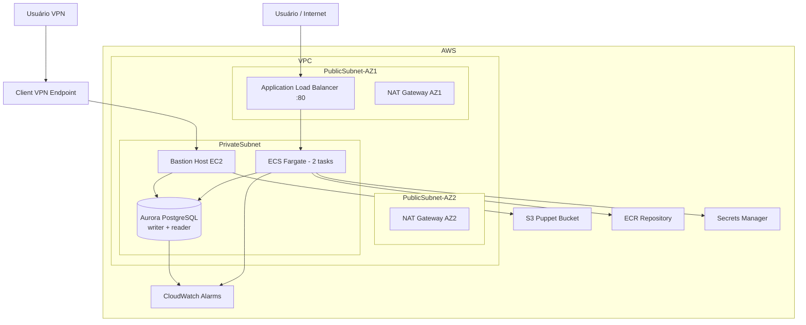
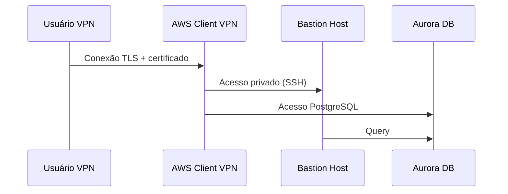
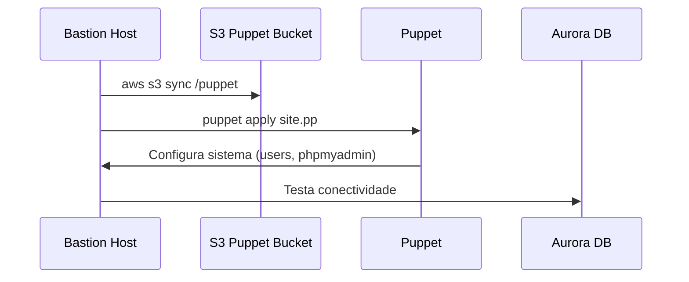
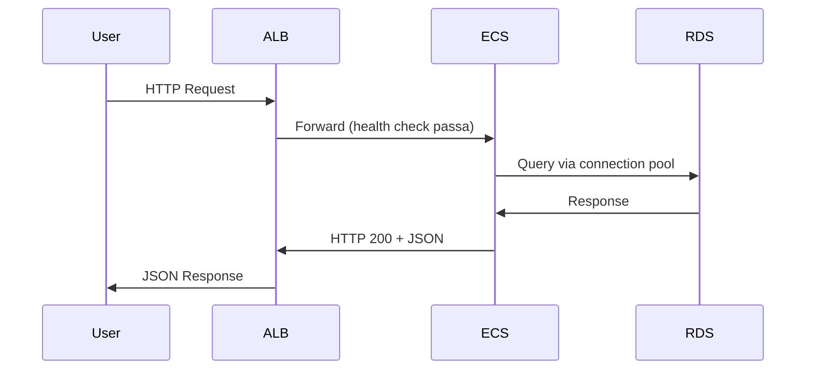
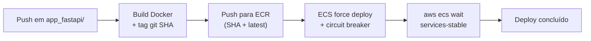
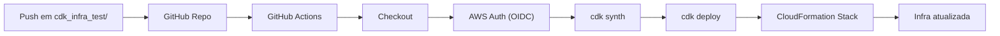

# Projeto: Infraestrutura AWS com CDK, ECS, RDS, Puppet e FastAPI

Este projeto provisiona uma infraestrutura **pronta para produção** na AWS utilizando AWS CDK (Python), integrando:

- VPC multi-AZ com NAT Gateway redundante
- EC2 Bastion Host com Puppet e IMDSv2
- RDS Aurora PostgreSQL Serverless v2 com backup e proteção contra deleção
- ECS Fargate com alta disponibilidade e auto-scaling
- ECR com lifecycle rules
- Application Load Balancer com deletion protection
- Aplicação FastAPI com connection pooling e error handling
- VPN Client-to-Site com logs de conexão
- Monitoramento via CloudWatch Alarms
- Pipeline CI/CD com GitHub Actions

## Arquitetura



## Componentes da Infraestrutura

### S3 (Puppet Bucket)

Bucket responsável por armazenar os manifests e módulos Puppet.

- Versionamento habilitado
- Criptografia gerenciada pela AWS
- Acesso público totalmente bloqueado
- Política de retenção: dados preservados mesmo após remoção da stack
- Lifecycle: versões antigas expiram após 90 dias

### VPC

- 2 AZs
- **2 NAT Gateways** (alta disponibilidade por zona)
- Subnets públicas (ALB, NAT)
- Subnets privadas com egresso (ECS, RDS, Bastion)
- **VPC Flow Logs** habilitados para auditoria de tráfego

### VPN (Client-to-Site)

VPN gerenciada pela AWS para acesso seguro ao ambiente privado.

- Acesso ao Bastion Host sem IP público
- Autenticação baseada em certificado mútuo
- Split tunnel habilitado
- **Logs de conexão** no CloudWatch (retenção de 3 meses)



### Bastion Host (EC2)

Instância EC2 privada usada para acesso administrativo.

- Tipo: `t3.small`
- **IMDSv2 obrigatório** (proteção contra SSRF)
- Acesso via AWS SSM (sem abertura de portas públicas)
- Acesso SSH liberado apenas pela SG da VPN

**Inicialização automática:**

```bash
aws s3 sync s3://<bucket>/puppet /opt/puppet
puppet apply /opt/puppet/manifests/site.pp
```

### RDS Aurora PostgreSQL Serverless v2

| Configuração | Valor |
|---|---|
| Engine | Aurora PostgreSQL 14 |
| Capacidade mínima | 0.5 ACU |
| Capacidade máxima | 8 ACU |
| Backup | 7 dias de retenção |
| Deletion protection | Habilitado |
| Remoção da stack | Snapshot preservado |
| Enhanced Monitoring | 60s interval |
| Logs exportados | PostgreSQL → CloudWatch |
| Criptografia | Habilitada |
| Credenciais | Geradas pelo Secrets Manager |

### ECR (Elastic Container Registry)

- Scan de vulnerabilidades a cada push
- Política de retenção: imagens preservadas após remoção da stack
- Lifecycle rules:
  - Imagens sem tag removidas após 1 dia
  - Máximo de 10 imagens por repositório

### ECS Fargate

Executa a aplicação FastAPI com alta disponibilidade.

| Configuração | Valor |
|---|---|
| CPU por task | 512 units (0.5 vCPU) |
| Memória por task | 1024 MiB |
| Tasks desejadas | 2 (mínimo) |
| Auto-scaling | min=2, max=10 |
| Escalonamento por CPU | target 70% |
| Escalonamento por memória | target 80% |
| Circuit breaker | Habilitado com rollback automático |
| Container Insights | Habilitado |
| Container health check | `GET /health` a cada 30s |

**Papéis IAM separados:**
- **Execution Role**: pull de imagem ECR + injeção de secrets (princípio do menor privilégio)
- **Task Role**: apenas escrita de logs no CloudWatch

**Variáveis injetadas:**

| Variável | Origem |
|---|---|
| `DB_NAME` | Environment variable |
| `DB_HOST` | Environment variable |
| `DB_USER` | Secrets Manager |
| `DB_PASSWORD` | Secrets Manager |

### Application Load Balancer (ALB)

- Porta: 80
- Roteia requisições para ECS
- Health check: `GET /health` (threshold: 2 healthy / 3 unhealthy)
- Deregistration delay: 30s
- **Deletion protection** habilitado

### CloudWatch Alarms

| Alarme | Threshold | Períodos |
|---|---|---|
| ECS CPU | > 85% | 3 de 3 |
| ECS Memory | > 90% | 3 de 3 |
| ALB Response Time | > 2s | 2 de 2 |

## Aplicação FastAPI

**Local:** `app_fastapi/`

**Endpoints:**

| Método | Path | Descrição |
|---|---|---|
| GET | `/health` | Health check com verificação de conectividade ao banco |
| POST | `/items` | Insere um item (body JSON: `{"name": "..."}`) |
| GET | `/items` | Lista itens (query param: `limit`, padrão 50) |

**Funcionalidades de produção:**

- Connection pool (`ThreadedConnectionPool`, min=1, max=10)
- Error handling com rollback de transação
- Logging estruturado
- Validação de input via Pydantic
- Schema da tabela criado automaticamente no startup
- Health check valida conectividade real com o banco

**Exemplo de uso:**

```bash
# Health check
curl http://<ALB-DNS>/health

# Criar item
curl -X POST http://<ALB-DNS>/items \
  -H "Content-Type: application/json" \
  -d '{"name": "meu-item"}'

# Listar itens
curl "http://<ALB-DNS>/items?limit=10"
```

## Dockerfile

- Imagem base: `python:3.11-slim`
- **Usuário non-root** (`appuser`)
- **HEALTHCHECK** nativo do Docker
- Uvicorn com 2 workers

## Puppet

**Estrutura:**

```
puppet/
├── manifests/
│   └── site.pp
└── modules/
    ├── users/
    │   └── manifests/init.pp
    └── phpmyadmin/
        └── manifests/init.pp
```

**Módulos:**

- `users`: cria o usuário `adminuser` com diretório `.ssh`
- `phpmyadmin`: instala `httpd`, `php` e `phpmyadmin`

## GitHub Actions (Workflows)

### Infra Deploy (`infra-deploy.yml`)

Disparado por push em `cdk_infra_test/`, `app.py`, `requirements.txt` ou `cdk.json`.

```
Checkout → AWS OIDC Auth → cdk synth → cdk deploy
```

### App Build & Push (`app-build-push.yml`)

Disparado por push em `app_fastapi/`.

```
Checkout → AWS OIDC Auth → ECR URI do CloudFormation
→ Build Docker → Tag com git SHA + latest
→ Push ECR → ECS force deploy → Aguarda estabilização
```

- URI do ECR obtido dinamicamente dos outputs do CloudFormation (sem hardcode)
- Imagem tagueada com `git SHA` para rastreabilidade e `latest` para conveniência
- `aws ecs wait services-stable` garante que o deploy estabilizou antes de reportar sucesso

### Puppet Sync (`puppet-sync.yml`)

Disparado por push em `puppet/`.

```
Checkout → AWS OIDC Auth → S3 sync → Reboot Bastion
```

## Como executar

1. **Instalar dependências**

   ```bash
   pip install -r requirements.txt
   npm install -g aws-cdk
   ```

2. **Bootstrap do CDK** (apenas na primeira vez)

   ```bash
   cdk bootstrap
   ```

3. **Validar síntese**

   ```bash
   cdk synth
   ```

4. **Deploy da infra**

   ```bash
   cdk deploy
   ```

5. **Rodar os testes**

   ```bash
   pip install -r requirements-dev.txt
   pytest
   ```

## Outputs do CloudFormation

| Output | Descrição |
|---|---|
| `ApplicationURL` | URL pública da aplicação |
| `BastionInstanceID` | ID da instância Bastion |
| `DatabaseClusterEndpoint` | Endpoint do cluster Aurora |
| `DatabaseName` | Nome do banco (`appdb`) |
| `DatabaseSecretArn` | ARN do secret com credenciais |
| `EcsClusterName` | Nome do cluster ECS |
| `EcsServiceName` | Nome do service ECS |
| `EcrRepositoryUri` | URI do repositório ECR |
| `PuppetBucketName` | Nome do bucket Puppet |
| `VpnEndpointId` | ID do endpoint VPN |

## Boas práticas implementadas

**Rede e acesso:**
- Subnets privadas para todos os workloads
- Sem IP público no ECS
- Acesso administrativo exclusivo via VPN + SSM
- IMDSv2 obrigatório no Bastion
- VPC Flow Logs habilitados

**Banco de dados:**
- Credenciais gerenciadas pelo Secrets Manager
- Deletion protection habilitado
- Backup com 7 dias de retenção
- Snapshot preservado ao deletar a stack
- Criptografia em repouso habilitada
- Enhanced monitoring e logs exportados

**Aplicação:**
- Roles IAM com menor privilégio (execution role ≠ task role)
- Connection pool para eficiência
- Circuit breaker com rollback automático
- Auto-scaling baseado em métricas reais

**Imagens:**
- Usuário non-root no container
- Scan de vulnerabilidades no ECR
- Lifecycle rules para evitar acúmulo de imagens

**Rastreabilidade:**
- Imagens tagueadas com git SHA
- VPN com logs de conexão
- CloudWatch Alarms para CPU, memória e latência

**IaC e pipeline:**
- Infraestrutura 100% como código (CDK)
- CI/CD com OIDC (sem credenciais de longa duração)
- Deploy aguarda estabilização do ECS

## Tecnologias

- AWS CDK v2 (Python)
- FastAPI + Uvicorn
- ECS Fargate
- Aurora PostgreSQL Serverless v2
- Puppet
- Docker
- GitHub Actions
- AWS Client VPN

## Fluxo de Inicialização do Bastion (Boot)



## Fluxo da Aplicação (Request)



## Fluxo do Deploy da Aplicação



## Fluxo do Pipeline de Infra


